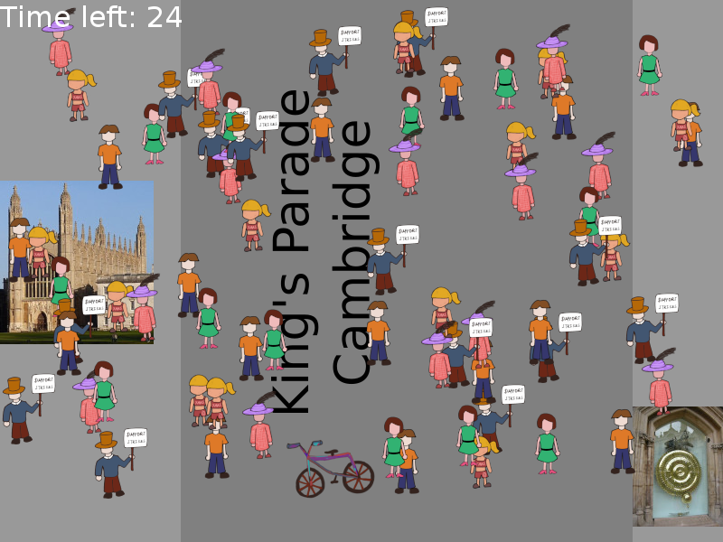

# 2019-GameGig-Hackathon

**LÖVE or Love2D game engine required.**

*Love2D version 11.1* was used in the Hackathon.

___

Game project for the *2019 Game Gig Countdown Edition Hackathon* at the *Computer Labs* in the *University of Cambridge*. Team members are *Gavin Choy* and *Hui Taou Kok*.

This is a game where the player is the bicycle starting at the bottom of the window. The player needs to ride their bicycle to the top of the window within a duration of time (a countdown timer was set to be 30 seconds) in order to win.

This game is set on King's Parade which is a street in Cambridge that is notorious for pedestrians crossing the street. It is intended to be impossible to win the game because there are too many pedestrians crossing the road!

A video demonstration is available by clicking the image below:

Gavin Choy and Hui Taou Kok:

___

Credits for the image of King's College by LegesRomanoru, licensed under the GNU Free Documentation License, Version 1.2 and Creative Commons Attribution-ShareAlike 3.0 License. Source: https://en.wikipedia.org/wiki/File:King%27s_College_Cambridge_from_the_Backs.jpg

Credits for the image of the Corpus Clock by Sailko, licensed under the GNU Free Documentation License, Version 1.2 and Creative Commons Attribution-ShareAlike 3.0 License. Source: https://commons.wikimedia.org/wiki/File:Corpus_Clock_01.JPG

Credits for the "Crash Large Sound" which is licensed as the Public Domain. Source: http://soundbible.com/1172-Crash-Large.html

All other materials were created by the authors of this project.
